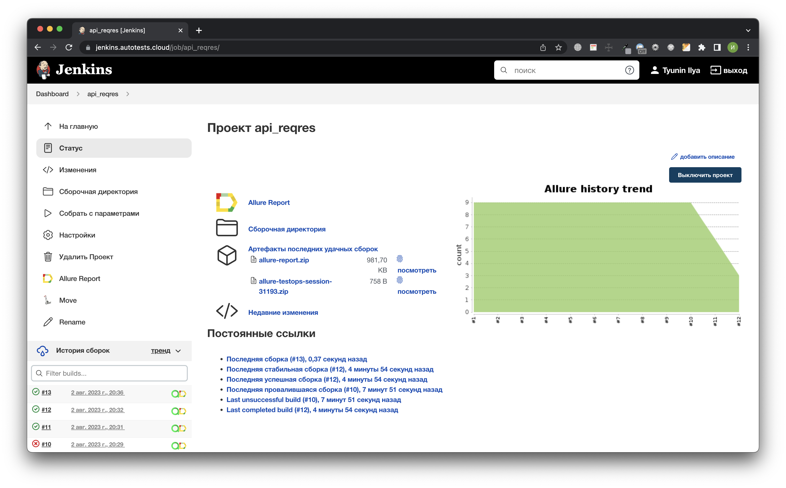
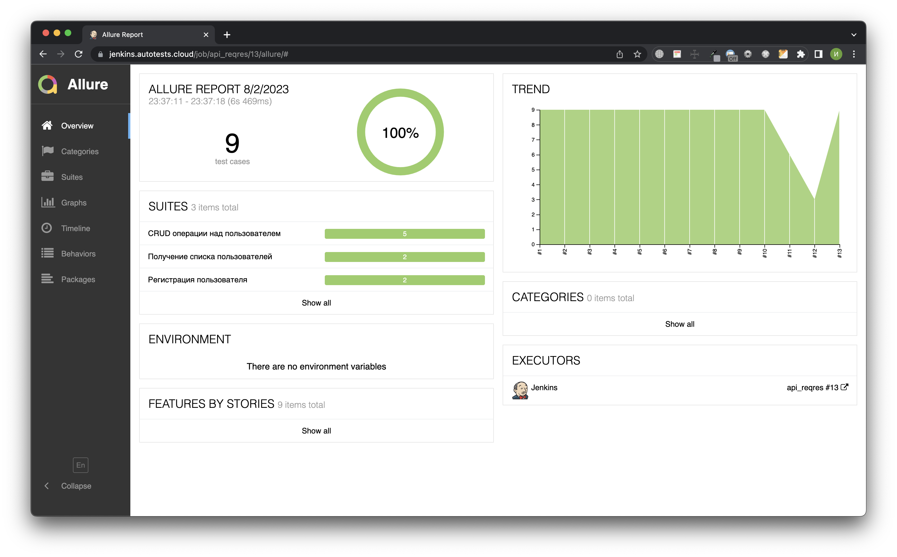
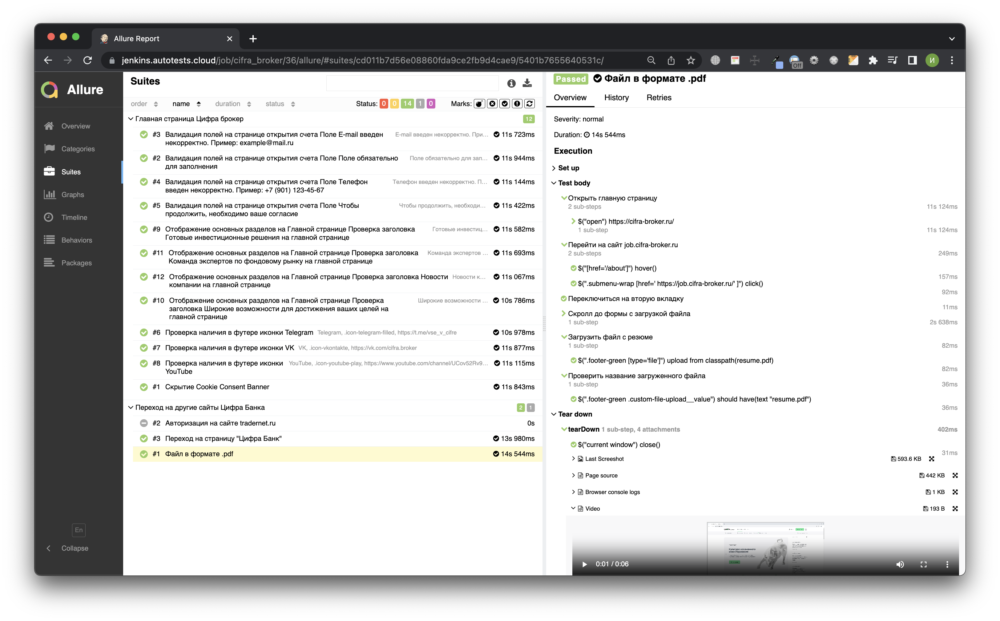
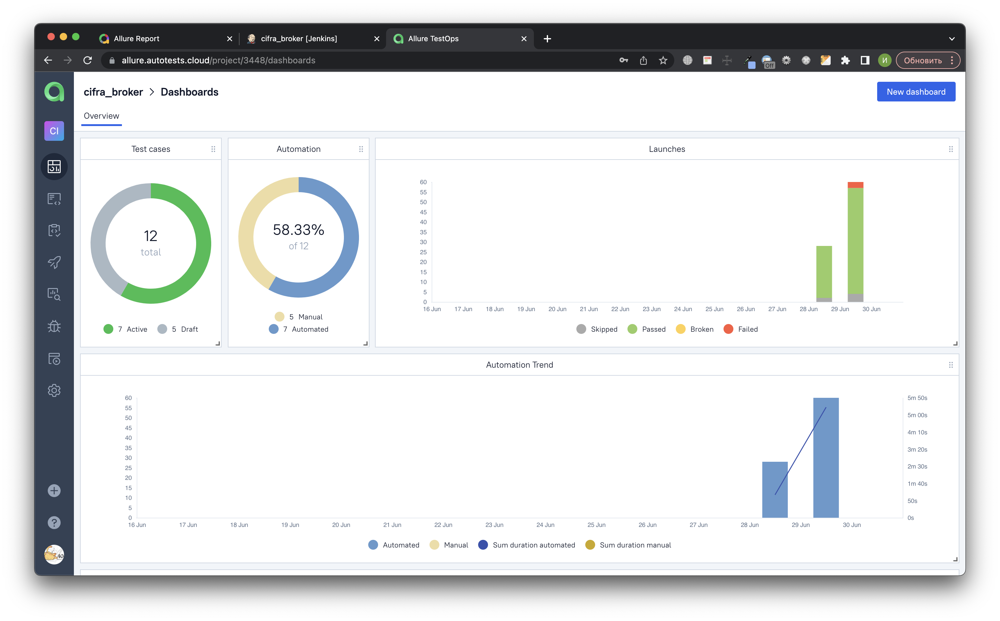
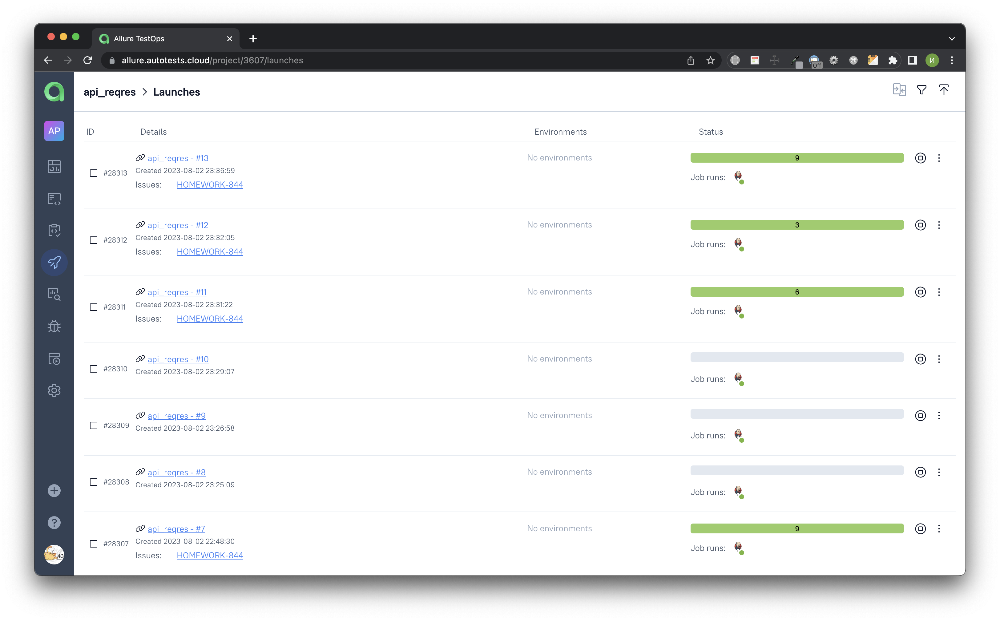
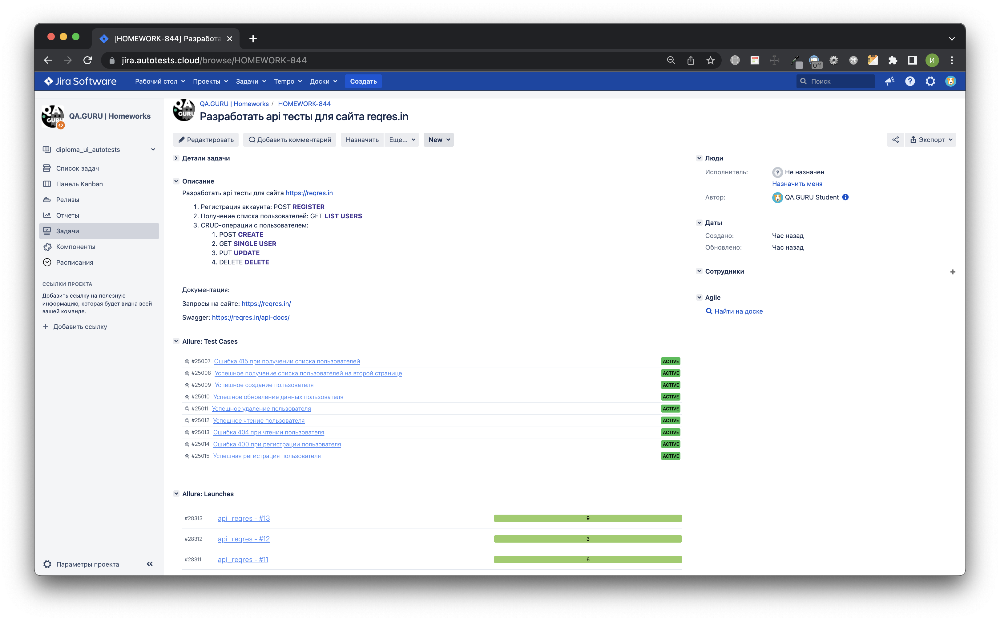
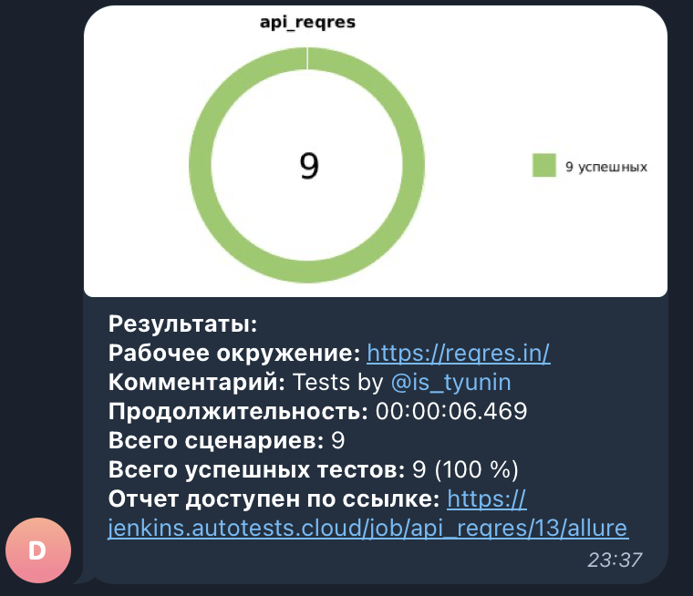

# Проект по автоматизации API-запросов для сайта [reqres.in](https://reqres.in/)
reqres.in — является тренировочным ресурсом для взаимодействия с API.

## :pushpin: Содержание:

- [Используемый стек](#-используемый-стек)
- [Список тестов](#heavy_check_mark-список-тестов)
- [Запуск автотестов](#arrow_forward-запуск-автотестов)
- [Сборка в Jenkins](#-сборка-в-jenkins)
- [Пример Allure-отчета](#-пример-allure-отчета)
- [Интеграция с Allure TestOps](#-интеграция-с-allure-testOps)
- [Интеграция с Jira](#-интеграция-с-jira)
- [Уведомления в Telegram](#-уведомления-в-telegram)
## &#129470; Используемый стек

<p align="center">


</p>

- Тесты в данном проекте написаны на языке <code>Java</code> с использованием фреймворка <code>Rest-Assured</code>
- В качестве сборщика использован <code>Gradle</code>
- В качестве фреймворка модульного тестирования задействован <code>JUnit 5</code>
- Для удаленного запуска реализована джоба в <code>Jenkins</code> с формированием Allure-отчета и отправкой результатов в <code>Telegram</code> при помощи бота
- Осуществлена интеграция с <code>Allure TestOps</code> и <code>Jira</code>

## :heavy_check_mark: Список тестов

- [x] Регистрация аккаунта: POST REGISTER
- [x] Получение списка пользователей: GET LIST USERS 
- CRUD-операции с пользователем:
- [x] Создание пользователя POST CREATE
- [x] Получение пользователя GET SINGLE USER
- [x] Обновление данных пользователя PUT UPDATE
- [x] Удаление пользователя DELETE

## :arrow_forward: Запуск автотестов
### Варианты запуска тестов
- ```test``` — Запуск всех тестов
- ```positive_test``` — Запуск позитивных тестов
- ```negative_tests``` — Запуск негативных тестов
### Запуск тестов локально из терминала
```
gradle clean test
```

##  Сборка в Jenkins
### Параметры сборки
* <code>TASK</code> — выбор запуска тестов. Значение по-умолчанию — <code>chrome</code> — запуск всех тестов.

<p align="center">

</p>

##  Пример Allure-отчета
<p align="center">

</p>

### Результат выполнения теста содержит:

* Request с вложением ```Метод запроса, Адрес, Headers, Body, Curl```
* Response с вложением ```Status code, Headers, Body```

<p align="center">

</p>

##  Интеграция с Allure TestOps
На вкладке <code>Dashboards</code> отображается:
- Количество тест-кейсов и их статус
- Соотношение ручных/автоматизированных тестов
- Результаты запусков/прохождения тестов в графике по датам
<p align="center">

</p>

На вкладке <code>Launches</code> можно увидеть результаты запусков автоматизированных тестов
<p align="center">

</p>

##  Интеграция с Jira
Реализована интеграция <code>Allure TestOps</code> с <code>Jira</code>. В задаче отображаются прикреплённые к ней тест-кейсы, а также результаты запусков/прохождения тестов.
<p align="center">

</p>

###  Уведомления в Telegram
После завершения сборки, бот, созданный в <code>Telegram</code>, автоматически обрабатывает и отправляет сообщение с результатом.
<p align="center">


</p>
